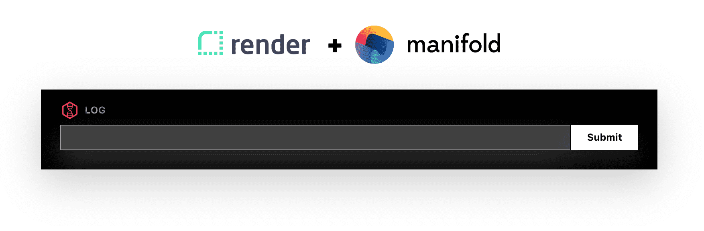

# Express example app



## 🔧 Setup

First install all dependencies:

```bash
npm i
```

Next, copy `.env.example` to `.env`, and enter in your LogDNA credentials from your Render
Dashboard:


```env
ACCOUNT=MY_ACCOUNT_ID
KEY=MY_SECRET_KEY
```

Lastly, start the server:

```bash
npm run start
```

You’ll be up and running at `localhost:3001`.
