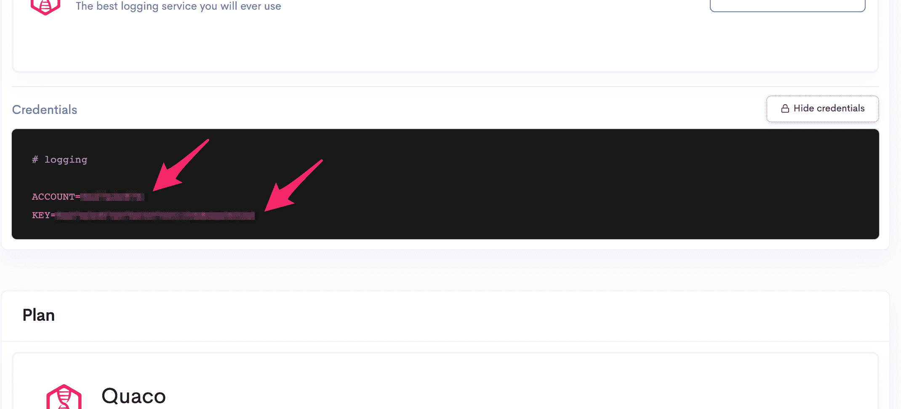

# Express example app

## 🔧 Setup

First install all dependencies:

```
npm i
```

Next, copy `.env.example` to `.env`, and enter in your LogDNA credentials from your Render
Dashboard:



```env
ACCOUNT=MY_ACCOUNT_ID
KEY=MY_SECRET_KEY
```
